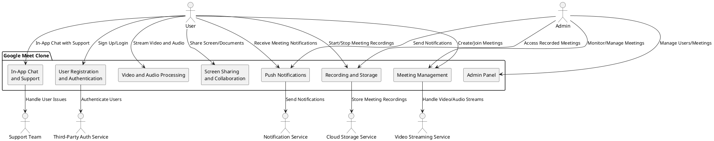
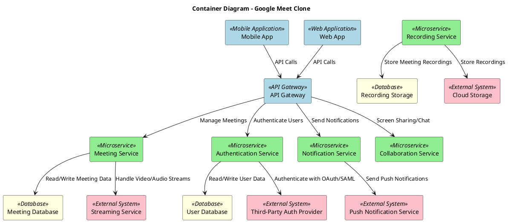
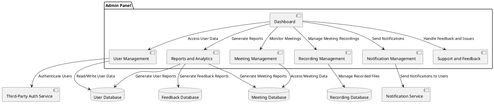
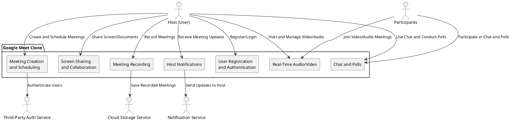
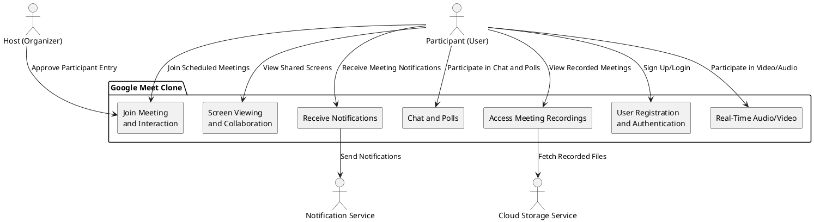
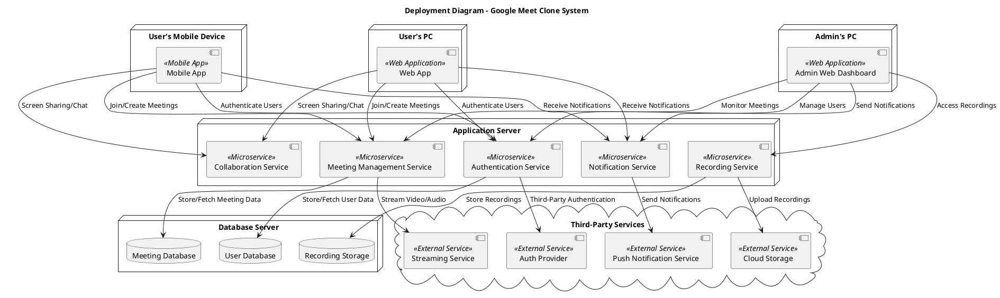

# System Context Diagram code

```plantuml
@startuml

    ' External Actors
    actor "User" as User
    actor "Admin" as Admin
    actor "Third-Party Auth Service" as AuthService
    actor "Notification Service" as NotificationService
    actor "Video Streaming Service" as StreamingService
    actor "Cloud Storage Service" as CloudStorage
    actor "Support Team" as SupportTeam

    ' System Boundary: Google Meet Clone
    package "Google Meet Clone" {

        ' Subsystems
        rectangle "User Registration \nand Authentication" as Registration
        rectangle "Meeting Management" as MeetingManagement
        rectangle "Video and Audio Processing" as VideoAudioProcessing
        rectangle "Screen Sharing \nand Collaboration" as ScreenSharing
        rectangle "Push Notifications" as PushNotifications
        rectangle "Recording and Storage" as Recording
        rectangle "Admin Panel" as AdminPanel
        rectangle "In-App Chat \nand Support" as ChatSupport
    }

    ' Relationships between actors and system components
    User --> Registration : Sign Up/Login
    User --> MeetingManagement : Create/Join Meetings
    User --> VideoAudioProcessing : Stream Video and Audio
    User --> ScreenSharing : Share Screen/Documents
    User --> PushNotifications : Receive Meeting Notifications
    User --> Recording : Start/Stop Meeting Recordings
    User --> ChatSupport : In-App Chat with Support

    Admin --> AdminPanel : Manage Users/Meetings
    Admin --> MeetingManagement : Monitor/Manage Meetings
    Admin --> PushNotifications : Send Notifications
    Admin --> Recording : Access Recorded Meetings

    ' External Interactions
    Registration --> AuthService : Authenticate Users
    MeetingManagement --> StreamingService : Handle Video/Audio Streams
    PushNotifications --> NotificationService : Send Notifications
    Recording --> CloudStorage : Store Meeting Recordings
    ChatSupport --> SupportTeam : Handle User Issues

@enduml
```
# Container Diagram

```plantuml
@startuml
!define RECTANGLE rectangle
!define BOLD **<color:Black>**

title Container Diagram - Google Meet Clone

' Add primary containers
' User section
RECTANGLE "Mobile App" as mobileApp <<Mobile Application>> #lightblue
RECTANGLE "Web App" as webApp <<Web Application>> #lightblue
RECTANGLE "API Gateway" as apiGateway <<API Gateway>> #lightblue

' Backend services
RECTANGLE "Meeting Service" as meetingService <<Microservice>> #lightgreen
RECTANGLE "Authentication Service" as authService <<Microservice>> #lightgreen
RECTANGLE "Notification Service" as notificationService <<Microservice>> #lightgreen
RECTANGLE "Recording Service" as recordingService <<Microservice>> #lightgreen
RECTANGLE "Collaboration Service" as collaborationService <<Microservice>> #lightgreen

' Database containers
RECTANGLE "User Database" as userDB <<Database>> #lightyellow
RECTANGLE "Meeting Database" as meetingDB <<Database>> #lightyellow
RECTANGLE "Recording Storage" as recordingDB <<Database>> #lightyellow

' External systems
RECTANGLE "Third-Party Auth Provider" as thirdPartyAuth <<External System>> #pink
RECTANGLE "Push Notification Service" as pushNotification <<External System>> #pink
RECTANGLE "Cloud Storage" as cloudStorage <<External System>> #pink
RECTANGLE "Streaming Service" as streamingService <<External System>> #pink

' Relationships between containers
mobileApp --> apiGateway : "API Calls"
webApp --> apiGateway : "API Calls"
apiGateway --> meetingService : "Manage Meetings"
apiGateway --> authService : "Authenticate Users"
apiGateway --> notificationService : "Send Notifications"
apiGateway --> collaborationService : "Screen Sharing/Chat"

meetingService --> meetingDB : "Read/Write Meeting Data"
authService --> userDB : "Read/Write User Data"
recordingService --> recordingDB : "Store Meeting Recordings"
notificationService --> pushNotification : "Send Push Notifications"

recordingService --> cloudStorage : "Store Recordings"
meetingService --> streamingService : "Handle Video/Audio Streams"
authService --> thirdPartyAuth : "Authenticate with OAuth/SAML"

@enduml
```
# Component Diagram

## Admin

```plantuml
@startuml

' Define the system components for the Admin Panel
package "Admin Panel" {
    component "Dashboard" as Dashboard
    component "User Management" as UserManagement
    component "Meeting Management" as MeetingManagement
    component "Recording Management" as RecordingManagement
    component "Reports and Analytics" as ReportsAnalytics
    component "Notification Management" as NotificationManagement
    component "Support and Feedback" as SupportFeedback
}

' External services used by the Admin Panel
database "User Database" as UserDB
database "Meeting Database" as MeetingDB
database "Recording Database" as RecordingDB
database "Feedback Database" as FeedbackDB
component "Notification Service" as NotificationService
component "Third-Party Auth Service" as AuthService

' Relationships between Admin Panel components
Dashboard --> UserManagement : Access User Data
Dashboard --> MeetingManagement : Monitor Meetings
Dashboard --> RecordingManagement : Manage Meeting Recordings
Dashboard --> ReportsAnalytics : Generate Reports
Dashboard --> NotificationManagement : Send Notifications
Dashboard --> SupportFeedback : Handle Feedback and Issues

' Internal component interactions
UserManagement --> UserDB : Read/Write User Data
MeetingManagement --> MeetingDB : Access Meeting Data
RecordingManagement --> RecordingDB : Manage Recorded Files
ReportsAnalytics --> UserDB : Generate User Reports
ReportsAnalytics --> MeetingDB : Generate Meeting Reports
ReportsAnalytics --> FeedbackDB : Generate Feedback Reports

' External interactions
NotificationManagement --> NotificationService : Send Notifications to Users
UserManagement --> AuthService : Authenticate Users

@enduml
```
## Host User

```plantuml
@startuml

' External Actors
actor "Host (User)" as Host
actor "Participants" as Participants
actor "Notification Service" as NotificationService
actor "Cloud Storage Service" as CloudStorage
actor "Third-Party Auth Service" as AuthService

' System Boundary: Google Meet Clone
package "Google Meet Clone" {

    ' Subsystems related to Hosts
    rectangle "User Registration \nand Authentication" as Registration
    rectangle "Meeting Creation \nand Scheduling" as MeetingScheduling
    rectangle "Real-Time Audio/Video" as VideoAudio
    rectangle "Screen Sharing \nand Collaboration" as ScreenSharing
    rectangle "Meeting Recording" as Recording
    rectangle "Host Notifications" as HostNotifications
    rectangle "Chat and Polls" as ChatPolls
}

' Relationships for the Host and system components
Host --> Registration : Register/Login
Host --> MeetingScheduling : Create and Schedule Meetings
Host --> VideoAudio : Host and Manage Video/Audio
Host --> ScreenSharing : Share Screen/Documents
Host --> Recording : Record Meetings
Host --> HostNotifications : Receive Meeting Updates
Host --> ChatPolls : Use Chat and Conduct Polls

Participants --> VideoAudio : Join Video/Audio Meetings
Participants --> ChatPolls : Participate in Chat and Polls

' External Interactions
MeetingScheduling --> AuthService : Authenticate Users
Recording --> CloudStorage : Save Recorded Meetings
HostNotifications --> NotificationService : Send Updates to Host

@enduml
```
## Participant User

```plantuml
@startuml

' External Actors
actor "Participant (User)" as Participant
actor "Host (Organizer)" as Host
actor "Notification Service" as NotificationService
actor "Cloud Storage Service" as CloudStorage

' System Boundary: Google Meet Clone
package "Google Meet Clone" {

    ' Subsystems related to Participants
    rectangle "User Registration \nand Authentication" as Registration
    rectangle "Join Meeting \nand Interaction" as JoinMeeting
    rectangle "Real-Time Audio/Video" as VideoAudio
    rectangle "Screen Viewing \nand Collaboration" as ScreenViewing
    rectangle "Receive Notifications" as Notifications
    rectangle "Chat and Polls" as ChatPolls
    rectangle "Access Meeting Recordings" as AccessRecordings
}

' Relationships for Participants and system components
Participant --> Registration : Sign Up/Login
Participant --> JoinMeeting : Join Scheduled Meetings
Participant --> VideoAudio : Participate in Video/Audio
Participant --> ScreenViewing : View Shared Screens
Participant --> Notifications : Receive Meeting Notifications
Participant --> ChatPolls : Participate in Chat and Polls
Participant --> AccessRecordings : View Recorded Meetings

Host --> JoinMeeting : Approve Participant Entry

' External Interactions
Notifications --> NotificationService : Send Notifications
AccessRecordings --> CloudStorage : Fetch Recorded Files

@enduml

```

# Deployment Diagram Code

```plantuml
@startuml
title Deployment Diagram - Google Meet Clone System

node "User's Mobile Device" {
    [Mobile App] <<Mobile App>>
}

node "User's PC" {
    [Web App] <<Web Application>>
}

node "Admin's PC" {
    [Admin Web Dashboard] <<Web Application>>
}

node "Application Server" {
    [Meeting Management Service] <<Microservice>>
    [Authentication Service] <<Microservice>>
    [Notification Service] <<Microservice>>
    [Collaboration Service] <<Microservice>>
    [Recording Service] <<Microservice>>
}

node "Database Server" {
    database "User Database" as UserDB
    database "Meeting Database" as MeetingDB
    database "Recording Storage" as RecordingDB
}

cloud "Third-Party Services" {
    [Auth Provider] <<External Service>>
    [Push Notification Service] <<External Service>>
    [Streaming Service] <<External Service>>
    [Cloud Storage] <<External Service>>
}

' Connections
[Mobile App] --> [Meeting Management Service] : "Join/Create Meetings"
[Mobile App] --> [Authentication Service] : "Authenticate Users"
[Mobile App] --> [Notification Service] : "Receive Notifications"
[Mobile App] --> [Collaboration Service] : "Screen Sharing/Chat"

[Web App] --> [Meeting Management Service] : "Join/Create Meetings"
[Web App] --> [Authentication Service] : "Authenticate Users"
[Web App] --> [Notification Service] : "Receive Notifications"
[Web App] --> [Collaboration Service] : "Screen Sharing/Chat"

[Admin Web Dashboard] --> [Meeting Management Service] : "Monitor Meetings"
[Admin Web Dashboard] --> [Authentication Service] : "Manage Users"
[Admin Web Dashboard] --> [Notification Service] : "Send Notifications"
[Admin Web Dashboard] --> [Recording Service] : "Access Recordings"

[Meeting Management Service] --> MeetingDB : "Store/Fetch Meeting Data"
[Authentication Service] --> UserDB : "Store/Fetch User Data"
[Recording Service] --> RecordingDB : "Store Recordings"
[Notification Service] --> [Push Notification Service] : "Send Notifications"

[Recording Service] --> [Cloud Storage] : "Upload Recordings"
[Meeting Management Service] --> [Streaming Service] : "Stream Video/Audio"
[Authentication Service] --> [Auth Provider] : "Third-Party Authentication"

@enduml
```
