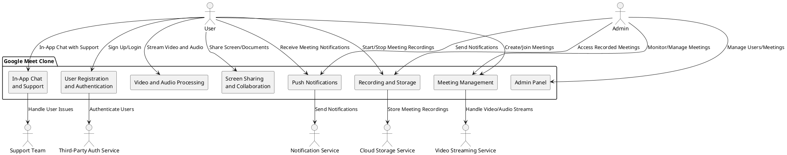
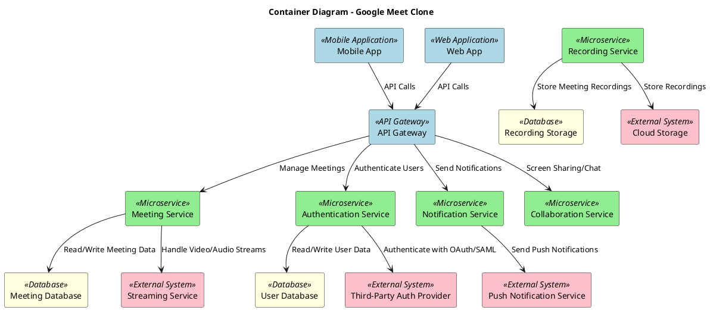

# System Context Diagram code

```plantuml
@startuml

    ' External Actors
    actor "User" as User
    actor "Admin" as Admin
    actor "Third-Party Auth Service" as AuthService
    actor "Notification Service" as NotificationService
    actor "Video Streaming Service" as StreamingService
    actor "Cloud Storage Service" as CloudStorage
    actor "Support Team" as SupportTeam

    ' System Boundary: Google Meet Clone
    package "Google Meet Clone" {

        ' Subsystems
        rectangle "User Registration \nand Authentication" as Registration
        rectangle "Meeting Management" as MeetingManagement
        rectangle "Video and Audio Processing" as VideoAudioProcessing
        rectangle "Screen Sharing \nand Collaboration" as ScreenSharing
        rectangle "Push Notifications" as PushNotifications
        rectangle "Recording and Storage" as Recording
        rectangle "Admin Panel" as AdminPanel
        rectangle "In-App Chat \nand Support" as ChatSupport
    }

    ' Relationships between actors and system components
    User --> Registration : Sign Up/Login
    User --> MeetingManagement : Create/Join Meetings
    User --> VideoAudioProcessing : Stream Video and Audio
    User --> ScreenSharing : Share Screen/Documents
    User --> PushNotifications : Receive Meeting Notifications
    User --> Recording : Start/Stop Meeting Recordings
    User --> ChatSupport : In-App Chat with Support

    Admin --> AdminPanel : Manage Users/Meetings
    Admin --> MeetingManagement : Monitor/Manage Meetings
    Admin --> PushNotifications : Send Notifications
    Admin --> Recording : Access Recorded Meetings

    ' External Interactions
    Registration --> AuthService : Authenticate Users
    MeetingManagement --> StreamingService : Handle Video/Audio Streams
    PushNotifications --> NotificationService : Send Notifications
    Recording --> CloudStorage : Store Meeting Recordings
    ChatSupport --> SupportTeam : Handle User Issues

@enduml
```
# Container Diagram

```plantuml
@startuml
!define RECTANGLE rectangle
!define BOLD **<color:Black>**

title Container Diagram - Google Meet Clone

' Add primary containers
' User section
RECTANGLE "Mobile App" as mobileApp <<Mobile Application>> #lightblue
RECTANGLE "Web App" as webApp <<Web Application>> #lightblue
RECTANGLE "API Gateway" as apiGateway <<API Gateway>> #lightblue

' Backend services
RECTANGLE "Meeting Service" as meetingService <<Microservice>> #lightgreen
RECTANGLE "Authentication Service" as authService <<Microservice>> #lightgreen
RECTANGLE "Notification Service" as notificationService <<Microservice>> #lightgreen
RECTANGLE "Recording Service" as recordingService <<Microservice>> #lightgreen
RECTANGLE "Collaboration Service" as collaborationService <<Microservice>> #lightgreen

' Database containers
RECTANGLE "User Database" as userDB <<Database>> #lightyellow
RECTANGLE "Meeting Database" as meetingDB <<Database>> #lightyellow
RECTANGLE "Recording Storage" as recordingDB <<Database>> #lightyellow

' External systems
RECTANGLE "Third-Party Auth Provider" as thirdPartyAuth <<External System>> #pink
RECTANGLE "Push Notification Service" as pushNotification <<External System>> #pink
RECTANGLE "Cloud Storage" as cloudStorage <<External System>> #pink
RECTANGLE "Streaming Service" as streamingService <<External System>> #pink

' Relationships between containers
mobileApp --> apiGateway : "API Calls"
webApp --> apiGateway : "API Calls"
apiGateway --> meetingService : "Manage Meetings"
apiGateway --> authService : "Authenticate Users"
apiGateway --> notificationService : "Send Notifications"
apiGateway --> collaborationService : "Screen Sharing/Chat"

meetingService --> meetingDB : "Read/Write Meeting Data"
authService --> userDB : "Read/Write User Data"
recordingService --> recordingDB : "Store Meeting Recordings"
notificationService --> pushNotification : "Send Push Notifications"

recordingService --> cloudStorage : "Store Recordings"
meetingService --> streamingService : "Handle Video/Audio Streams"
authService --> thirdPartyAuth : "Authenticate with OAuth/SAML"

@enduml
```

