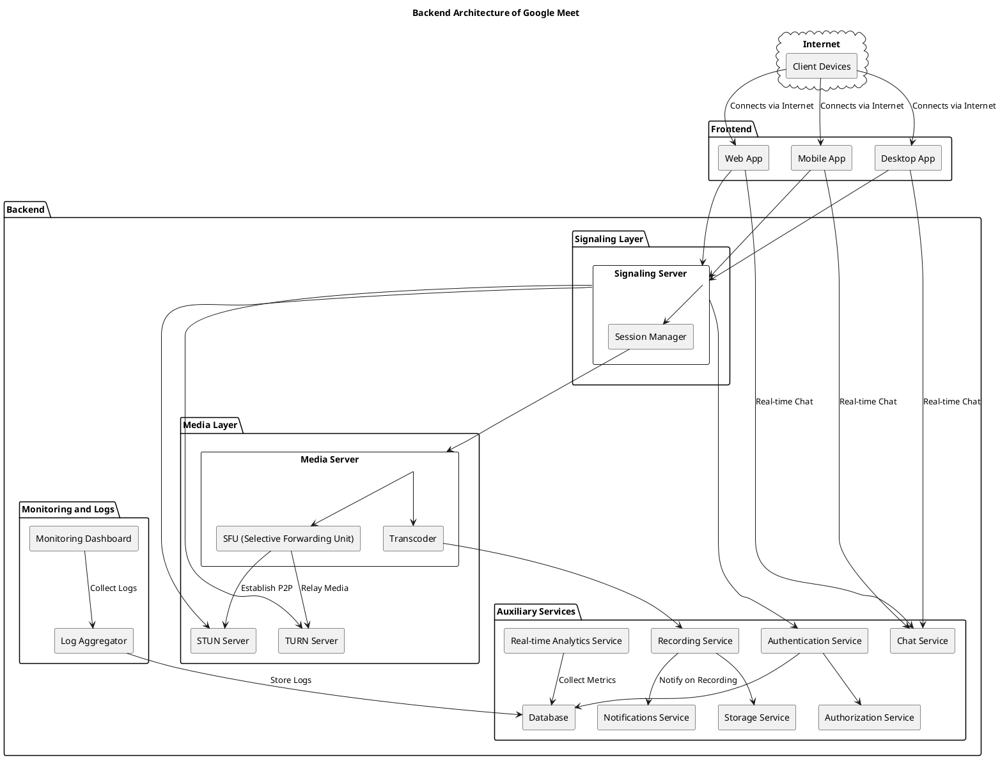

# Software Design Description (SDD) - Google Meet Clone

## 1. Introduction

### 1.1 Purpose
The purpose of this Software Design Description (SDD) is to provide a detailed design for a video conferencing platform similar to Google Meet. The document outlines the software’s architecture, components, interfaces, and their interactions to ensure that the system meets both functional and non-functional requirements.

### 1.2 Scope
The Google Meet clone enables users to host and join video meetings via web and mobile applications. The system supports video/audio communication, screen sharing, real-time chat, participant management, and integrations with external services such as calendar tools. This design includes frontend and backend components, as well as the database design.

### 1.3 Design Goals
- Create a scalable and reliable video conferencing platform.
- Ensure smooth real-time communication with high video/audio quality.
- Provide a responsive, intuitive, and cross-platform user interface.
- Integrate with external services such as Google Calendar.
- Implement secure authentication and communication.

### 1.4 Architectural Principles
- **Microservices architecture** for modularity and scalability.
- **Real-time communication** using WebRTC or similar technology.
- **Event-driven design** for real-time notifications and updates.
- **Cloud-native architecture** to ensure scalability and redundancy.
- **Containerized deployment** for consistent environments.

## 2. System Architecture

### 2.1 Overview
The architecture of the Google Meet clone is based on a microservices model with key components separated into layers. These layers handle specific aspects of the application, including user interaction, video/audio communication, data storage, and third-party integrations.

### 2.2 Frontend Architecture

The frontend architecture includes:
- **Presentation Layer**: 
  - User Interface (UI) components built with React and React Native.
  - Responsive layouts using **Tailwind CSS** for styling.
  - Real-time video and audio control using **WebRTC**.
  
- **State Management**:
  - **Redux** for managing global state (e.g., user data, meeting state).
  - **Context API** for local component-level states.

- **Services Layer**:
  - APIs to interact with backend services like authentication, meeting scheduling, and video/audio handling.
  
- **Routing**:
  - **React Router** for web application navigation.
  - **React Navigation** for mobile apps.

#### Key Components:
- **Meeting Screen**: Displays video feed, chat, participant list, and control buttons.
- **Join Screen**: Allows users to enter meeting ID/link.
- **Scheduling Screen**: For creating and managing meetings.
- **Profile and Settings**: To manage user settings and preferences.

### 2.3 Backend System Architecture

## 2.3.1 Distributed Service Ecosystem
### Microservices Architecture
- Independently scalable services

### Event-Driven Communication
- Kafka/RabbitMQ for inter-service messaging

### Service Discovery
- Consul/Kubernetes for dynamic service registration

## 2.3.2 Authentication and Security Layer

### 1. Identity Management
- JWT-based authentication
- Role-based access control
- OAuth 2.0 and OpenID Connect support
- Passwordless authentication options

### 2. Security Mechanisms
- Encrypted token storage
- Brute-force protection
- Cross-Site Scripting (XSS) prevention
- SQL injection safeguards

## 2.3.3 Content Management Services

### 1. Video Processing Service
- Multi-format video transcoding
- Adaptive bitrate streaming
- Thumbnail generation
- Metadata extraction
- Content moderation

### 2. Storage Management
- Distributed file storage (AWS S3/Google Cloud Storage)
- Content Delivery Network (CDN) integration
- Efficient storage tiering
- Backup and disaster recovery

## 2.3.4 Recommendation and Discovery Engine

### 1. Machine Learning Models
- Collaborative filtering
- Content-based recommendation
- Hybrid recommendation algorithms
- User behavior analysis

### 2. Personalization Mechanisms
- Real-time preference tracking
- Contextual recommendation
- A/B testing recommendation strategies
- Diversity and serendipity in suggestions

## 2.3.5 Interaction and Engagement Services

### 1. User Interaction Tracking
- Like, comment, and share mechanisms
- Notification dispatch system
- Engagement metrics collection
- Community interaction workflows

### 2. Social Features
- Follow/subscribe functionality
- User-generated playlists
- Community content curation
- Collaborative viewing experiences

## 2.4 Cross-Cutting Concerns

### 2.4.1 Observability and Monitoring
- Distributed tracing
- Performance metrics collection
- Log aggregation
- Real-time alerting systems

### 2.4.2 Scalability Strategies
- Horizontal service scaling
- Load balancing
- Caching mechanisms
- Auto-scaling configuration

### 2.4.3 Compliance and Privacy
- GDPR compliance
- Data anonymization
- User consent management
- Transparent data handling

## 2.5 Advertising Ecosystem

### 2.5.1 Ad Targeting Strategy
- Demographic-based targeting
- Interest and behavior profiling
- Geographic location targeting
- Device-specific ad delivery

### 2.5.2 Ad Placement Types

#### Video Ad Formats
- Pre-roll ads
- Mid-roll ads
- Post-roll ads
- Overlay advertisements

#### Additional Placement Channels
- Sidebar recommendations
- Banner advertisements
- Sponsored content sections

### 2.5.3 Revenue Generation
- Impression-based pricing (CPM)
- Performance-based pricing (CPC)
- Revenue sharing with content creators
- Conversion tracking

### 2.5.4 Compliance and User Experience
- User ad preference settings
- Opt-out mechanisms
- Ad frequency capping
- Content moderation
- Brand safety filters

### 2.5.5 Technical Infrastructure
- Low-latency ad delivery
- Real-time bidding integration
- Fraud detection mechanisms
- Cross-platform ad compatibility

### 2.5.6 Advertiser Tools
- Self-service ad creation platform
- Campaign management dashboard
- Performance analytics
- A/B testing capabilities

### 2.6 Data Layer
The system will utilize a relational or NoSQL database for structured storage and fast access. Components include:

- **Primary Database**: **MongoDB** (NoSQL) for storing user data, meeting details, and session records.
- **Caching Layer**: **Redis** for fast access to frequently queried data like user sessions and meeting metadata.
- **File Storage**: **Amazon S3** or **Google Cloud Storage** for storing recorded meetings and user profile pictures.

## 3. System Components

### 3.1 Frontend Components
- **Home Screen**: Lists upcoming meetings and options to schedule new ones.
- **Meeting Screen**: Displays video feeds, chat, and controls for participants, screen sharing, and audio/video settings.
- **Join Screen**: Allows users to join meetings using meeting codes/links.
- **Settings/Profile**: Enables users to manage their profile, settings, and preferences.
  
### 3.2 Backend Components
- **API Gateway**: Handles routing for incoming requests and forwards them to the correct service.
- **Authentication Service**: Provides secure login and user management features.
- **Meeting Service**: Manages meeting data, schedules, and participants.
- **Real-time Communication Service**: Facilitates video/audio communication using **WebRTC**.
- **Notification Service**: Sends reminders, invites, and real-time updates to users.
  
## 4. Database Design

### 4.1 Database Schema
The database will be structured to store and retrieve data related to users, meetings, participants, and notifications. The major collections or tables will include:

- **Users**: Stores user profile data, including name, email, password, preferences, and authentication tokens.
- **Meetings**: Stores meeting details, such as title, scheduled time, participants, and status.
- **Participants**: A mapping of which users are participating in which meetings.
- **Notifications**: Stores meeting-related notifications like reminders and updates.
- **Meeting Recordings**: Metadata about recordings, such as file location, meeting ID, and participant list.

### 4.2 Data Flow
- Users will create and schedule meetings, which will be stored in the **Meetings** collection.
- When a user joins a meeting, the participant is recorded in the **Participants** table.
- Notifications are stored in the **Notifications** collection, which is sent via email/SMS or real-time channels.
- Meeting recordings and associated data will be stored in a cloud storage solution like **Amazon S3**.

## 5. Interface Design

### 5.1 API Design
The system will expose REST APIs and GraphQL endpoints for the frontend and third-party integrations:

- **POST /users/register**: Registers a new user.
- **POST /users/login**: Authenticates a user and returns a token.
- **POST /meetings**: Creates a new meeting.
- **GET /meetings/{id}**: Retrieves meeting details.
- **POST /join**: Allows a user to join an existing meeting using a meeting ID/link.
- **GET /notifications**: Fetches unread notifications.

### 5.2 Real-Time Communication
The backend will use **WebSocket** or **WebRTC signaling** to facilitate real-time communication for audio/video and chat functionalities. Additionally, the backend will support sending real-time notifications to the frontend when there are updates to meetings or user activities.

### 5.3 Third-Party Integration
- **Google Calendar API**: Sync meetings and send calendar invites.
- **WebRTC**: Real-time communication protocol for video/audio streaming and screen sharing.
- **Twilio/SendGrid**: For sending SMS and email notifications.

## 6. Non-Functional Requirements

### 6.1 Performance
- The system should support **up to 1000 concurrent participants** in a single meeting with minimal latency.
- Video and audio streams should have **low latency**, providing a seamless experience.

### 6.2 Scalability
- The system must be horizontally scalable, able to handle a growing number of users and meetings.
- Load balancing should be implemented to manage user traffic efficiently across multiple servers.

### 6.3 Availability
- The system must ensure **99.9% uptime** with backup servers and automatic failover mechanisms.

### 6.4 Security
- The system must implement **end-to-end encryption** for video/audio streams and chat messages.
- Secure authentication and authorization using **OAuth 2.0** and **JWT**.
- Data should be encrypted both at rest and in transit.

### 6.5 Usability
- The platform should offer a **responsive design** for both desktop and mobile devices.
- The UI must be **intuitive** and user-friendly, providing clear instructions for joining and scheduling meetings.

## 7. Conclusion
This Software Design Description (SDD) outlines the architecture, components, database design, and interfaces for the Google Meet-like video conferencing system. The design ensures scalability, security, and real-time communication, while providing a smooth and responsive user experience. The modular architecture allows easy maintenance and future enhancements, such as adding new features like recording, live captions, or enhanced collaboration tools.
